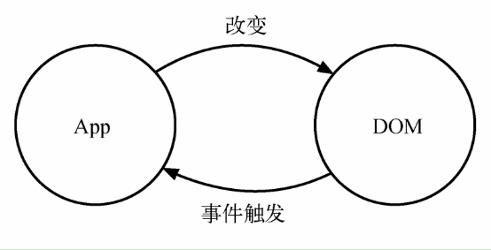
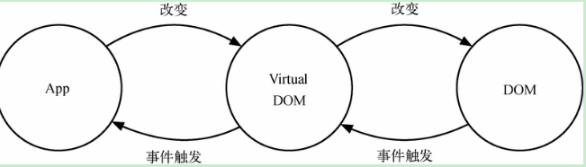

- [初入 React 世界](#%E5%88%9D%E5%85%A5-react-%E4%B8%96%E7%95%8C)
- [漫谈 React](#%E6%BC%AB%E8%B0%88-react)

# 初入 React 世界

- 传统 DOM 更新
  
- React DOM 更新
  

  > DOM 操作非常昂贵.`在前端开发中性能损耗最大的是DOM操作`,而且这部分代码会让整体项目的代码变得难以维护，React 把真实 DOM 树转换成 Virtual-DOM

- Virutal-DOM 的好处还在于方便和其他平台集成，比如 React-native 是基于 Virutal-DOM 渲染出原生控件，因为 React 组件可以映射出对应的原生控件，在输出的时候是输出 Web DOM，还是 Android 控件，还是 ios 控件，可以由平台来控制

- 在 React 中，到处都是可以复用的元素，这些元素并不是真实的案例，它只是让 React 告诉开发者想要在屏幕上显示什么，我们无法调用这些元素，他们只是不可变的描述对象

- XML 是 JSX 的一个子集

- 在适合的情况下，我们都应该且必须使用无状态组件，无状态组件不想 class，createClass 方法创建的组件在调用时会创建新实例，它创建时始终保持了一个实例，避免了不必要的检查和内存分配，做到了内部优化

- 如果说组能够分解，那我们一定要分解，并使用子组件的方式处理

```javascript
render() {
    return (<div>{React.Children.map(this.props.children, (child) => { ... })</div>})
}
```

- 这种调用方式称为 Dynamic Children (动态子组件)。它指的是组件内的子组件是通过动态计算得到的。就像上述对子组件的遍历一样，我们可以对任何数据，字符串，数组或对象作动态计算

- React 组件的生命周期根据广义定义描述，可以分为挂载，渲染和卸载这几个阶段。当渲染后的组件需要更新时，我们会去重新去渲染组件

  > - 当组件在挂载或卸载时
  > - 当组件接收新的数据时，即组件更新时

- 如果我们在 componentDidMount 中执行 setState 方法，组件当然会再次更新 (计算组件的位置或宽高时，就不得不让组件先渲染，更新必要的信息后，再次渲染)

- findDOMNode 获得该组件 DOM

- 要获取一个 React 组件的引用，既可以使用 this 来获取当前 React 组件，也可以使用 refs 来获取你拥有的子组件的引用

# 漫谈 React
