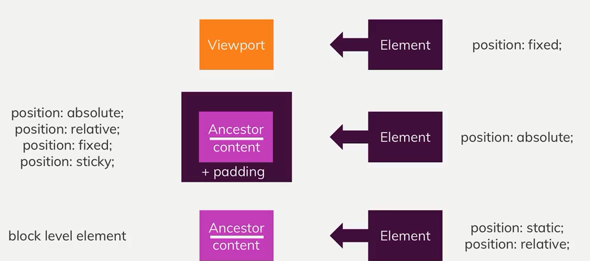
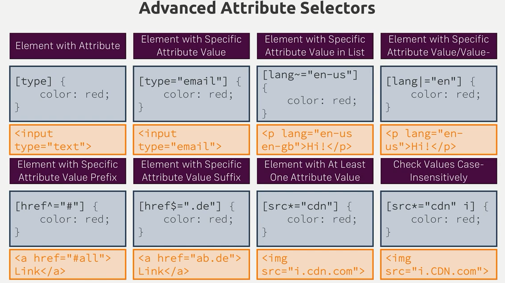
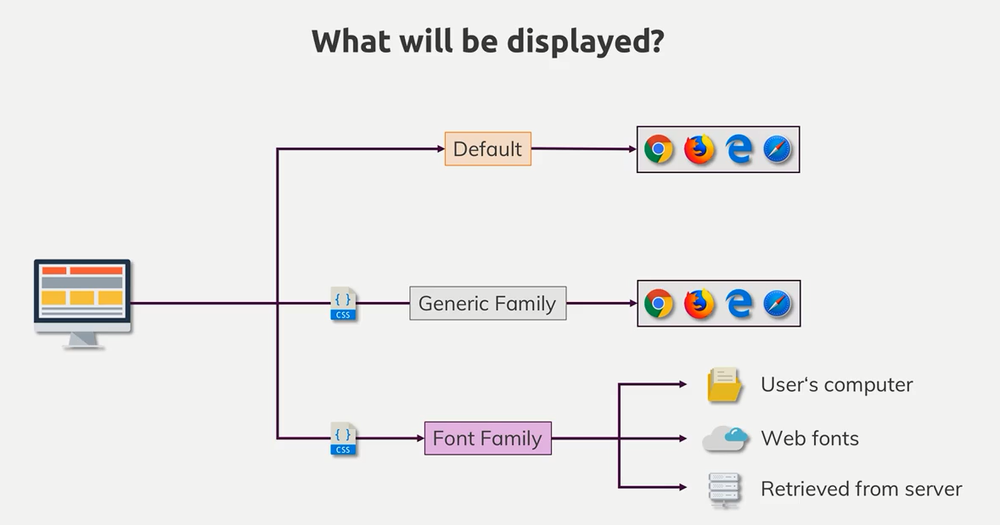

- [CSS放置元素的一些知识](#css%E6%94%BE%E7%BD%AE%E5%85%83%E7%B4%A0%E7%9A%84%E4%B8%80%E4%BA%9B%E7%9F%A5%E8%AF%86)
- [理解背景图片和图片](#%E7%90%86%E8%A7%A3%E8%83%8C%E6%99%AF%E5%9B%BE%E7%89%87%E5%92%8C%E5%9B%BE%E7%89%87)
  - [有关于background的一些属性](#%E6%9C%89%E5%85%B3%E4%BA%8Ebackground%E7%9A%84%E4%B8%80%E4%BA%9B%E5%B1%9E%E6%80%A7)
  - [有关于img标签的一些知识](#%E6%9C%89%E5%85%B3%E4%BA%8Eimg%E6%A0%87%E7%AD%BE%E7%9A%84%E4%B8%80%E4%BA%9B%E7%9F%A5%E8%AF%86)
  - [理解Linear-Gradients](#%E7%90%86%E8%A7%A3linear-gradients)
  - [理解Radial-Gradient](#%E7%90%86%E8%A7%A3radial-gradient)
- [理解CSS相关单位](#%E7%90%86%E8%A7%A3css%E7%9B%B8%E5%85%B3%E5%8D%95%E4%BD%8D)
- [网页自适应](#%E7%BD%91%E9%A1%B5%E8%87%AA%E9%80%82%E5%BA%94)
- [表单元素选择器](#%E8%A1%A8%E5%8D%95%E5%85%83%E7%B4%A0%E9%80%89%E6%8B%A9%E5%99%A8)
- [文字和字体](#%E6%96%87%E5%AD%97%E5%92%8C%E5%AD%97%E4%BD%93)
- [FlexBox](#flexbox)
- [CSS-Grid](#css-grid)
- [CSS Transforming](#css-transforming)
- [动画效果](#%E5%8A%A8%E7%94%BB%E6%95%88%E6%9E%9C)

# CSS放置元素的一些知识
+ **position: static**
> + 浏览器默认的position取值static
+ **Postion: fixed;** 
> + 位置相对于viewport;  
> + 可以使用vh (top: 50vh);
+ **z-index**
> + z-index 作用于设置了position属性的元素  
> + 默认的z-index的值为0     
> + z-index: auto和z-index: 0 等效  
> + z-index受限于父元素的z-index取值
+ **Position: absolute**
> + 如果`没有设置了postion的祖先元素`, `位置设定相对于html元素`  
> + 如果`有设置了postion的祖先元素`, `位置设定相对于最近的设置了的祖先元素`
+ **position: relative**
> + 设置该position的元素没有脱离出文档流, 位置设定相对于原先static设置所在的位置而定
+ **overflow**
> + 如果html未设置overflow属性, 在body设置overflow属性不生效, 并且css默认会将该属性设置在html中

# 理解背景图片和图片
## 有关于background的一些属性
+ **background-image: url(./...)**
+ **background-color**
> + image, color 可以共存 image在color上面显示
+ **background-size: 300px(%) 100px(%)**
> + 第一个值是宽度, 第二个值是高度
> + cover撑满容器 contain在该容器内尽可能地显示图片
+ **background-repeat: repeat | no-repeat | repeat-x | repeat-y**  
> + size与repeat一起使用实现按(x|y)轴平铺的效果
+ **background-position: left 10% bottom 20%;**
> + 在size设置为cover的情况下, 有部分图片被裁剪显示在容器之外(因为需要维持原图片比例), 通过调整position调整显示的区域, 设置为center即居中显示原图片信息, 详细的设置如上
+ background-origin: 设置背景的有效位置
+ background-clip: 裁剪图片的有效位置
> + border-box | content-box | padding-box 
> + 设置clip即重写了origin
+ background-attachment: 下滚动作发生时, img的反应设定
+ **简写**
> + background: url(./..) left 10% top 20%/cover no-repeat border-box

## 有关于img标签的一些知识
+ **在选定的img中设定长宽比例相对的是图片的原始比例, 而非父元素**
+ **在父元素设置display: inline-block, 使图片百分比依赖于父元素**

## 理解Linear-Gradients
+ **background-image: linear-gradient(towards,[color precent]*)**
> + 设置渐变的方向(to bottom | to left bottom | 180deg(to bottom))
> + 设置需要渐变的颜色以及该渐变色所花费的容器百分比
> + 完整的例子 background-image: linear-gradient(180deg, red 70%, blue 80%, black)

## 理解Radial-Gradient
+ **background-image: radial-gradient([[shape size] at postition],[color precent]*)**
> + 设置渐变的形状以及整个变形区域的大小(特殊预设取值:(colest | farthest) (side | corner))
> + 设置渐变形状的几何中心所处容器的位置
> + 设置渐变的颜色以及该渐变色所花费容器半径的百分比
> + 完整例子 background-image: radial-gradient(ellipse closest-corner at 20% 50%, red 50%, blue 70%, green)

+ **使用filter给背景图片加滤镜**

# 理解CSS相关单位



# 网页自适应
+ **理解html viewport meta标签**

> +  \<meta name="viewport" content="width=device-width, initial-scale=1.0, user-scable=yes[default]/no, maximum-scale=2.0, minimum-scale=0.5>  

+ **媒体查询横屏竖屏(orientation: portrait/landscape)**

# 表单元素选择器


# 文字和字体

+ **本地引入字体**
```css
@font-face {
  font-family：ExampleFont;
  src：url（/path/to/fonts/examplefont.woff）format（'woff'），
       url（/path/to/fonts/examplefont.eot）format（'eot'）;
  font-weight：400;
  font-style：normal;
  font-display：fallback;
}
```
+ **一些不常用的属性**
> + letter-spac: px/em
> + white-space:pre/pre-wrap/pre-line/no-wrap
> + line-height: 2（倍数） / px
> + text-decoration: underline/overline/ line-through
> + text-decoration: underline dotted red
> + text-shadow: 5 px 5px 2px gray

+ **简写**
> + font:italic(`style`) small-caps(`variant`) 700(`weight`) 1.2rem/2(`size/line-height`) "AnonymousPro", sans-serif(`family`);

+ **font-display**
> + [ auto | block | swap | fallback | optional ]
> + auto字体显示策略由用户代理定义。
block给字体面临一个短暂的周期和无限的交换周期。
> + swap为字体提供了一个非常小的块周期和无限的交换周期。
> + fallback为字体提供了一个非常小的块周期和短暂的交换周期。
> + optional为字体提供了一个非常小的块周期并且没有交换周期。

# FlexBox


+ **order: 根据flexBox的方向数字从小到大排列，默认的值是**

+ **align-self: 重写align-items**

+ **flex-grow/flex=shrink/flex-basis**

# CSS-Grid
+ **定义container容器网格**
```css
grid-template-column: repeat(4, 25%);
grid-template-rows: 5rem auto;
grid-template-rows: 5rem minmax(10px, auto) 100px;

grid-template-areas: "header header header header"
                      "side side main main"
                      "footer footer footer footer"

grid-template-rows: 3.5rem auto fit-content(8rem);
/*fit-content: 该区域大小不会大于8rem*/
```

+ **根据容器划分的网格自定义子元素占的区域**
```css
grid-column-start: 3;
grid-column-end: 5;
grid-column:3 / 5;
grid-area: header;

grid-row-start: 1;
grid-row-end: 3;
grid-row-end: span 2;
grid-row:1 / 3
grid-area: footer;
```
> 网格可以被重复使用

+ **网格间隙定义**
```css
grid-column-gap: 20px;
grid-row-gap: 10px;
```

+ **容器元素以及定义子元素的排列方向**
```css
justify-content: strech/center/start/end
justify-items: strech/center/start/end 
/*横向*/
align-content: strech/center/start/end 
align-items: strech/center/start/end 
/*竖向*/
```

+ **子元素对齐**
```css
justify-self: strech/center/start/end
align-self: strech/center/start/end
```

+ **Grid容器的自动流动（autoflow）**
```css
grid-auto-rows: minmax(8rem, auto)
grid-auto-colums: 5rem
grid-auto-flow: column
```

+ Grid容器元素根据view port自动填充
```css
grid-template-columns: repeat(auto-fill/auto-fit,10rem);
```

# CSS Transforming
+ **旋转元素**
> + tranform-origin: 50% 50% (center)
> + trnaform: rotateZ(45deg)

+ **平移元素**
> + transformX(3.5rem) transformY(-1rem) 

+ **歪斜元素**
> + skew(20deg)

+ **放缩元素**
> + scale(1.5)

+ **透视，3D变换，3D遮挡显示**

# 动画效果
+ **transition: opcity(需要动画效果的属性) 200ms(动画效果持续的时间) ease-out(动画效果的方式) 1s(延迟时间)**

+ **CSS-Animation**
```css
@keyframes wiggle {
  0% {
    transform: rotateZ(0deg);
  }
  50% {
    ...
  }
  100% {
    transform: rotateZ(10deg);
  }
}

.main-nav__item--cta {
  animation: wiggle 200ms 3s 8 ease-out  alternate/forwards/backwards;
}
```
```javascript
ctaButton.addEventListener('animationstart/animationend/')
```