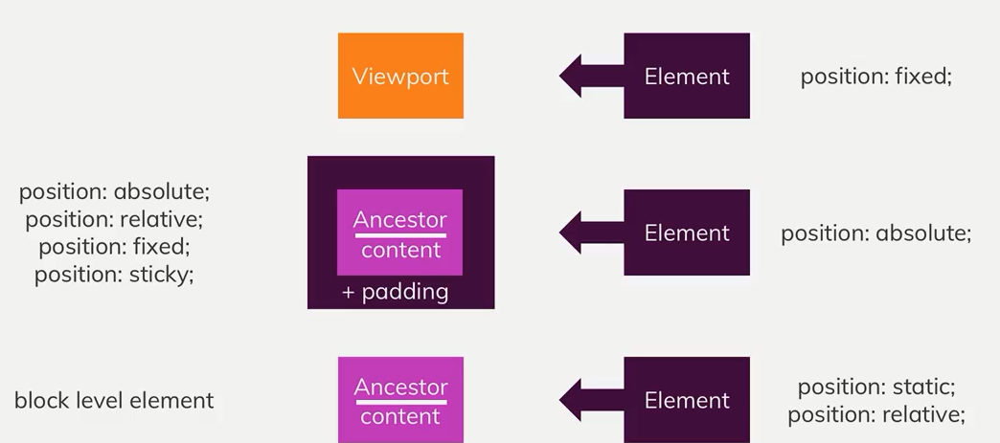
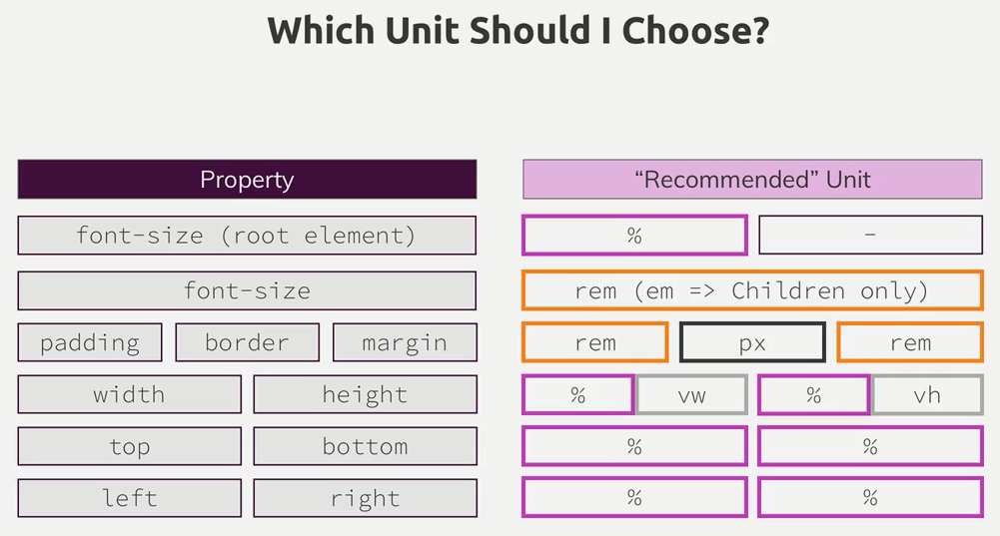

# CSS放置元素的一些知识
+ **position: static**
> + 浏览器默认的position取值static
+ **Postion: fixed;** 
> + 位置相对于viewport;  
> + 可以使用vh (top: 50vh);
+ **z-index**
> + z-index 作用于设置了position属性的元素  
> + 默认的z-index的值为0     
> + z-index: auto和z-index: 0 等效  
> + z-index受限于父元素的z-index取值
+ **Position: absolute**
> + 如果`没有设置了postion的祖先元素`, `位置设定相对于html元素`  
> + 如果`有设置了postion的祖先元素`, `位置设定相对于最近的设置了的祖先元素`
+ **position: relative**
> + 设置该position的元素没有脱离出文档流, 位置设定相对于原先static设置所在的位置而定
+ **overflow**
> + 如果html未设置overflow属性, 在body设置overflow属性不生效, 并且css默认会将该属性设置在html中

# 理解背景图片和图片
## 有关于background的一些属性
+ **background-image: url(./...)**
+ **background-color**
> + image, color 可以共存 image在color上面显示
+ **background-size: 300px(%) 100px(%)**
> + 第一个值是宽度, 第二个值是高度
> + cover撑满容器 contain在该容器内尽可能地显示图片
+ **background-repeat: repeat | no-repeat | repeat-x | repeat-y**  
> + size与repeat一起使用实现按(x|y)轴平铺的效果
+ **background-position: left 10% bottom 20%;**
> + 在size设置为cover的情况下, 有部分图片被裁剪显示在容器之外(因为需要维持原图片比例), 通过调整position调整显示的区域, 设置为center即居中显示原图片信息, 详细的设置如上
+ background-origin: 设置背景的有效位置
+ background-clip: 裁剪图片的有效位置
> + border-box | content-box | padding-box 
> + 设置clip即重写了origin
+ background-attachment: 下滚动作发生时, img的反应设定
+ **简写**
> + background: url(./..) left 10% top 20%/cover no-repeat border-box

## 有关于img标签的一些知识
+ **在选定的img中设定长宽比例相对的是图片的原始比例, 而非父元素**
+ **在父元素设置display: inline-block, 使图片百分比依赖于父元素**

## 理解Linear-Gradients
+ **background-image: linear-gradient(towards,[color precent]*)**
> + 设置渐变的方向(to bottom | to left bottom | 180deg(to bottom))
> + 设置需要渐变的颜色以及该渐变色所花费的容器百分比
> + 完整的例子 background-image: linear-gradient(180deg, red 70%, blue 80%, black)

## 理解Radial-Gradient
+ **background-image: radial-gradient([[shape size] at postition],[color precent]*)**
> + 设置渐变的形状以及整个变形区域的大小(特殊预设取值:(colest | farthest) (side | corner))
> + 设置渐变形状的几何中心所处容器的位置
> + 设置渐变的颜色以及该渐变色所花费容器半径的百分比
> + 完整例子 background-image: radial-gradient(ellipse closest-corner at 20% 50%, red 50%, blue 70%, green)

+ **使用filter给背景图片加滤镜**

# 理解CSS相关单位

