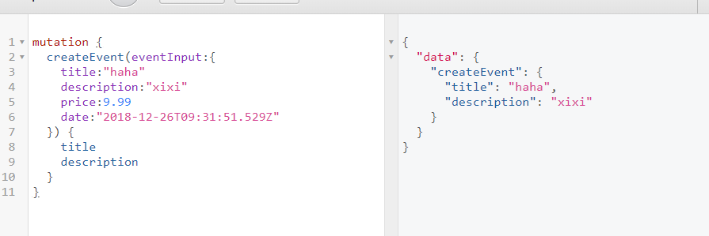
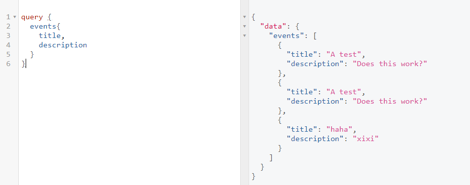

# Design & Project Setup

> npm install --save express body-parser express-graphql graphql

# Schema & Resolvers

```javascript
 schema {
    query:RootQuery
    // query - Get data
    mutation:RootMutation
    // mutation - Change data
}
```

```javascript
schema: buildSchema(`
    type RootQuery {
        events: [String!]!
    }
    ### To get a no null (no null String) list

    type RootMutation {
        createEvent(name: String): String
    }

    ### Recieve a String name and retrun a String

    schema {
        query:RootQuery
        mutation:RootMutation
    }
    `),
```

```javascript
// rootVlaue contains All the Schema Resolver,
// Each Resovlers's name is same to the Schema defined name
// and each of them is unique.
rootValue: {
    events: () => {
        return ["Romantic Cooking", "Cooking", "Coding allDay"];
    },
    createEvent: args => {
        const eventName = args.name;
        return eventName;
    }
 }
```

```javascript
// Open a UI-Interface in the browser for test.
// http://localhost:3000/graphql
graphiql: true;
```

# Types and Data

```javascript
// defined a schema in graphql
 type Event {
    _id: ID!,
    title: String!,
    description: String!,
    price: Float!,
    date: String!
}

// deefined a argument-input object in graphql
input EventInput {
    title:String!
    description:String!
    price:Float!
    date: String!
}
// use this object in graphql
// createEvent function recieve this object to create the Event Schema instance
// and return this event instance
type RootMutation {createEvent(eventInput:EventInput): Event}


// truly resolver
 createEvent: args => {
  const event = {
    _id: Math.random().toString(),
    title: args.eventInput.title,
    description: args.eventInput.description,
    price: +args.eventInput.price,
    date: new Date().toISOString()
  };
  events.push(event);
  return event;
}
```





# GraphQL + MongoDB

> use nodemon.json to config env var

```javascript
// define MongoDB Schema which have same meaning with GraphQL Schema
// MongoDB Schema
const eventSchema = new Schema({
  title: {
    type: String,
    required: true
  },
  description: {
    type: String,
    required: true
  },
  price: {
    type: Number,
    required: true
  },
  date: {
    type: Date,
    required: true
  }
});
// GraphQL Schema
type Event {
    _id: ID!,
    title: String!,
    description: String!,
    price: Float!,
    date: String!
}
```

```javascript
// GraphQL Resolver with mongoose
events: () => {
  // return the Promise Object to let GraphQL know he need to wait for resolve
  return Event.find({})
    .then(events => {
      return events.map(event => {
        // use moogoose defined inside variable _doc to get the needed info
        // use moogoose defined inside variable id to change the _id to string
        return { ...event._doc, _id: event.id };
      });
    })
    .catch(err => {
      console.log(err);
      throw err;
    });
},
createEvent: args => {
  const event = new Event({
    title: args.eventInput.title,
    description: args.eventInput.description,
    price: +args.eventInput.price,
    date: new Date(args.eventInput.date)
  });
  return event
    .save()
    .then(result => {
      console.log(result);
      return { ...result._doc, _id: event.id };
    })
    .catch(err => {
      console.log(err);
      // throw the err let graphQL know
      throw err;
    });
}
```

# Adding Relations

```javascript
// defined a realtioned Schema
const userSchema = new Schema({
  email: {
    type: String,
    required: true
  },
  password: {
    type: String,
    required: true
  },
  createdEvents: [
    {
      type: Schema.Types.ObjectId,
      // Related to Event Schema
      ref: "Event"
    }
  ]
});
```

```javascript
// defined the related graphQL schema and muatation
type User {
  _id: ID!
  email:String!
  password:String
}

type RootMutation {
  createEvent(eventInput:EventInput): Event
  createUser(userInput:UserInput):User
}

createUser: args => {
  return User.findOne({
    email: args.userInput.email
  })
  .then(user => {
    // Check the user if already exists
    if (user) {
      throw new Error("user exists already.");
    } else {
      // crypt the password
      return bcrypt
        .hash(args.userInput.password, 12)
        .then(hashedPassword => {
          const user = new User({
            email: args.userInput.email,
            password: hashedPassword
          });
      return user
        .save()
        .then(result => {
          return { ...result._doc, password: null, _id: result.id };
          })
        .catch(err => {
          throw err;
      });
  })
  .catch(err => {
    throw err;
  });}
});
}
```

```javascript
// When you create a event push the event ID into the creator's createdEvents array
let createdEvent;
return event
  .save()
  .then(result => {
    // Get this createdEvent in this promise resolver
    createdEvent = { ...result._doc, _id: event.id };
    // return a user Promise
    return User.findById("5c2874679bfa0d426c291614");
  })
  .then(user => {
    if (!user) {
      throw new Error("User is not found");
    }
    // push this event into the createdEvents array
    user.createdEvents.push(event);
    return user.save();
  })
  .then(result => {
    // retrun the createdEvent
    return createdEvent;
  })
  .catch(err => {
    throw err;
  });
```

> **tips**: Every time you use a promise in the graphQL buildSchema you all need return this promise to let graphQL wait for his ending rather than ended up early

# Dynamic Relations

```javascript
// use the populate function to get the ref Schema's data
rootValue: {
events: () => {
  return Event.find({})
    // here to poplulate the creator
    .populate("creator")
    .then(events => {
      return events.map(event => {
        return {
          ...event._doc,
          _id: event.id,
          // then you can return the info of creator here
          creator: {
            ...event._doc.creator._doc,
            _id: event._doc.creator.id
          }
        };
      });
    })
    .catch(err => {
      throw err;
    });
},
```

```javascript
// insted of using populate function, using the self defined function to get the data from the ref Schema
const Events = eventIds => {
  return Event.find({ _id: { $in: eventIds } })
    .then(events => {
      return events.map(event => {
        return {
          ...event._doc,
          _id: event.id,
          date: new Date(event._doc.date).toISOString(),
          // use bind for passing the arguments
          creator: user.bind(this, event.creator)
        };
      });
    })
    .catch(err => {
      throw err;
    });
};

const user = userId => {
  return User.findById(userId)
    .then(user => {
      return {
        ...user._doc,
        _id: user.id,
        createdEvents: Events.bind(this, user._doc.createdEvents)
      };
    })
    .catch(err => {
      throw err;
    });
};

// change the function into async await syntax
const user = async userId => {
  try {
    const user = await User.findById(userId);
    return {
      ...user._doc,
      _id: user.id,
      createdEvents: Events.bind(this, user._doc.createdEvents)
    };
  } catch (err) {
    throw err;
  }
};
```

# Adding Booking

```javascript
// defined the booking Model
const bookingSchema = new Schema(
  {
    event: {
      type: Schema.Types.ObjectId,
      ref: "Event"
    },
    user: {
      type: Schema.Types.ObjectId,
      ref: "User"
    }
  },
  // defined timestamps true to use these below
  // createdAt: new Date(result._doc.createdAt).toISOString() &
  // updatedAt: new Date(result._doc.updatedAt).toISOString()
  { timestamps: true }
);

bookEvent: async args => {
   const fetchedEvent = await Event.findOne({ _id: args.eventId });
   const booking = new Booking({
     user: "5c2874679bfa0d426c291614",
     // through you defined the type was ObjectId, you can save the fetchedEvent here
     // the system will transform it automatically
     event: fetchedEvent
   });
   const result = await booking.save();
   return {
     ...result._doc,
     _id: result.id,
     user: user.bind(this, booking._doc.user),
     event: singleEvent.bind(this, booking._doc.event),
     createdAt: new Date(result._doc.createdAt).toISOString(),
     updatedAt: new Date(result._doc.updatedAt).toISOString()
   };
 },

```

# Refactoring our Code

```javascript
// refactoring all the transformed model logic in one js file
const transformEvent = event => {
  return {
    ...event._doc,
    _id: event.id,
    date: dateToString(event._doc.date),
    creator: user.bind(this, event._doc.creator)
  };
};
```

```javascript
// split all the resolver logic and merge them in the index.js file
const authResolver = require("./auth");
const bookingResolver = require("./booking");
const eventsResolver = require("./events");

const rootResolver = {
  ...authResolver,
  ...bookingResolver,
  ...eventsResolver
};

module.exports = rootResolver;
```

# Adding User Authentication

```javascript
// Add the authentication graphQL schema
type AuthData {
    userId: ID!
    token: String!
    tokenExpiration: Int!
}

login(email: String!,password: String!):AuthData!
```

```javascript
// Add the realted resolver
login: async ({ email, password }) => {
  const user = await User.findOne({ email: email });
  if (!user) {
    throw new Error("User does not exist!");
  }
  // Verify the password
  const isEqual = await bcrypt.compare(password, user.password);
  if (!isEqual) {
    throw new Error("Password is incorrect!");
  }
  // generator the token
  const token = jwt.sign(
    {
      userId: user.id,
      email: user.email
    },
    "secret",
    {
      expiresIn: "1h"
    }
  );
  // return the info
  return {
    userId: user.id,
    token: token,
    tokenExpiration: 1
  };
};
```

```javascript
// add the middleware
const jwt = require("jsonwebtoken");

module.exports = (req, res, next) => {
  const authHeader = req.get("Authorization");
  if (!authHeader) {
    req.isAuth = false;
    return next();
  }
  const token = authHeader.split(" ")[1];
  if (!token || token === "") {
    req.isAuth = false;
    return next();
  }
  let decodedToken;
  try {
    decodedToken = jwt.verify(token, "secret");
  } catch (err) {
    req.isAuth = false;
    return next();
  }
  if (!decodedToken) {
    req.isAuth = false;
    return next();
  }
  req.isAuth = true;
  req.userId = decodedToken.userId;
  req.email = decodedToken.email;
  return next();
};
```

```javascript
// use the middleware
app.use(isAuth)****
```

# The react Frontend

```javascript
  // Create the ref By the crateRef() API
  constructor(props) {
    super(props);
    this.emailEl = React.createRef();
    this.passwordEl = React.createRef();
  }
  // Link the API to the true DOM
  <input type="email" id="email" ref={this.emailEl} />
  // Use this Ref for some data getting
  const email = this.emailEl.current.value;
  const password = this.passwordEl.current.value;

```

# Hitting the API

```javascript
// Sending a request to the graplQL API
sumbmitHandler = event => {
  event.preventDefault();
  const email = this.emailEl.current.value;
  const password = this.passwordEl.current.value;

  if (email.trim().length === 0 || password.trim().length === 0) {
    return;
  }

  let requestBody = {
    query: `
        query {
          login(email:"${email}", password:"${password}") {
            userId
            token
            tokenExpiration
          }
        }
      `
  };

  if (!this.state.isLogin) {
    requestBody = {
      query: `
          mutation {
            createUser(userInput: {email: "${email}", password: "${password}"}) {
              _id
              email
            }
          }
        `
    };
  }

  fetch("http://localhost:8000/graphql", {
    method: "POST",
    body: JSON.stringify(requestBody),
    headers: {
      "Content-type": "application/json"
    }
  })
    .then(res => {
      if (res.status !== 200 && res.status !== 201) {
        throw new Error("Failed!");
      }
      return res.json();
    })
    .then(resData => {
      console.log(resData);
    })
    .catch(err => {
      console.log(err);
    });
};
```

# Using the Token

> create a folder named **context** in the src folder

```javascript
// Create an context template using createContext API
export default React.createContext({
  token: null,
  userId: null,
  login: () => {},
  logout: () => {}
});
```

```javascript
state = {
  token: null,
  userId: null
};

login = (token, userId, tokenExpiration) => {
  this.setState({
    token,
    userId
  });
};

logout = () => {
  this.setState({
    token: null,
    userId: null
  });
};

<AuthContext.Provider
  // Initionlized the Contenxt by the AuthContext.Provider Component with value props
  value={{
    token: this.state.token,
    userId: this.state.userId,
    login: this.login,
    logout: this.logout
  }}
>
  <Navigation />
  <main className="main-content">
    <Switch>
      {!this.state.token && <Redirect from="/" to="/auth" exact />}
      {this.state.token && <Redirect from="/" to="/events" exact />}
      {this.state.token && <Redirect from="/auth" to="/events" exact />}
      {!this.state.token && <Route path="/auth" component={AuthPage} />}
      <Route path="/events" component={EventsPage} />
      {this.state.token && <Route path="/bookings" component={BookingsPage} />}
    </Switch>
  </main>
</AuthContext.Provider>;
```

```javascript
// Using  "static contextTpye" to defined the this.context
static contextType = AuthContext;

fetch("http://localhost:8000/graphql", {
  method: "POST",
  body: JSON.stringify(requestBody),
  headers: {
    "Content-type": "application/json"
  }
})
  .then(res => {
    if (res.status !== 200 && res.status !== 201) {
      throw new Error("Failed!");
    }
    return res.json();
  })
  .then(resData => {
    console.log(resData);
    if (resData.data.login.token) {
      console.log(this.context);
      // kick in the data
      this.context.login(
        resData.data.login.token,
        resData.data.login.userId,
        resData.data.login.tokenExpiration
      );
    }
  })
  .catch(err => {
    console.log(err);
  });
```

```javascript
// Using AuthContext.Consumer Component with "context=>{}" function to access the AuthContext's data
<AuthContext.Consumer>
  {context => {
    return (
      <header className="main-navigation">
        <div className="main-navigation__logo">
          <h1>EasyEvent</h1>
        </div>
        <nav className="main-navigation__item">
          <ul>
            <li>
              <NavLink to="/events">Events</NavLink>
            </li>
            // if context.token is true then show this li tag
            {context.token && (
              <li>
                <NavLink to="/bookings">Bookings</NavLink>
              </li>
            )}
            {!context.token && (
              <li>
                <NavLink to="/auth">Authentication</NavLink>
              </li>
            )}
          </ul>
        </nav>
      </header>
    );
  }}
</AuthContext.Consumer>
```

# Adding a Modal
> Creating an Modal and backDrop component
```javascript
// Modal component
<div className="modal">
  <header className="modal_header">
    <h1>{props.title}</h1>
  </header>
  <section className="modal_content">{props.children}</section>
  <section className="modal_actions">
    {props.canCancel && <button onClick={props.onCancel}>Cancel</button>}
    {props.canConfirm && <button onClick={props.onConfirm}>Confirm</button>}
  </section>
</div>

// BackDrop component
const backdrop = props => <div className="backdrop" />;
```
```css
# the css of the backdrop
# vh: 相对于视口的高度。视口被均分为100单位的vh
.backdrop {
    position: fixed;
    top: 0;
    left: 0;
    height: 100vh;
    width: 100%;
    background: rgba(0, 0, 0, 0.75);
}
```

```css
# Media Inquiries
# Using this style while the with is larger than 768px
@media (min-width: 768px) {
  .modal {
      width: 30rem;
      left: calc((100% - 30rem) / 2);
  }
}
```

# Adding Events

# Adding Event Features

# Using Dataloader

# Improving Queries & Bugfixing
```javascript
// the variable inside the query string
deleteBookingHandler = bookingId =>{
  this.setState({isLoading: true});
  const requestBody = {
    query:`
      mutation CancelBooking($id: ID!){
        cancelBooking(bookingId: $id){
          _id
          title
        }
      }
    `,
    variables: {
      id: bookingId
    }
  }
}
```