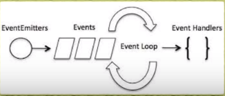

- [WHat is NODE.JS?](#what-is-nodejs)
- [Why use node?](#why-use-node)
- [NODE's Event Loop](#nodes-event-loop)
- [Best Types of the Projects for node](#best-types-of-the-projects-for-node)
- [Some useful Global Variable](#some-useful-global-variable)
- [Basic NodeJS Build-In Modules & Some Basic Mothods](#basic-nodejs-build-in-modules--some-basic-mothods)
  - [Modules - Path](#modules---path)
  - [Modules - fs](#modules---fs)
  - [Modules - URL](#modules---url)
  - [Modules - OS](#modules---os)
  - [Modules - Events](#modules---events)
  - [Modules - https](#modules---https)

# WHat is NODE.JS?
+ Javascript Runtime.(Not a language or a framwork)
+ Build on the V8 JavaScript engine.(Same a Google Chrome)
+ Written in C++.
+ Esentially allows us to run JavaScript code on the server.

# Why use node?
+ Fast, efficient and highly scalable.
+ Event drive, non-blockung I/O model.
+ Popular in the industry.
+ Same language on the ront and back end(JS).

# NODE's Event Loop
+ Single threaded.
+ Support concurrency via events & callbacks.(通过事件和回调支持并发)
+ EventEmitter class is used to bind events and listeners.   


# Best Types of the Projects for node
+ Anything that is not CPU intensive.
> + Rest API & Microservice.
> + Real Time Services(Chat, Live Updates)
> + CRUD Apps - Blogs, Shopping Carts, Social Networks
> + Tools & Utilities

# Some useful Global Variable
+ **Module Wrapper Function**
```javascript
(function (exports, require, module, __filename, __dirname) {

})
```
+ **__dirname**:`current work-folder absolute path`
+ **__filename**:`current work-file absolute path`


# Basic NodeJS Build-In Modules & Some Basic Mothods

## Modules - Path
```javascript
const path = require("path")

console.log(__filename);
// f:\reference\path_demo.js
console.log(path.basename(__filename));
// path_demo.js
console.log(path.dirname(__filename));
// f:\reference
console.log(path.extname(__filename));
// .js
console.log(path.parse(__filename));
// { 
//   root: 'f:\\',
//   dir:'f:\\reference',
//   base: 'path_demo.js',
//   ext: '.js',
//   name: 'path_demo' 
// }
console.log(path.join(__dirname,'test','hello.html'))
// ../test/hello.html
// f:\reference\test\hello.html
```
## Modules - fs
```javascript
const fs = require('fs');
const path = require('path');

// Create folder
fs.mkdir(path.join(__dirname, '/test'), {}, (err) => {
    if (err) console.log(err)
    console.log('Folder created...')
});
// # The test folder with be created in this folder.

// Create and write to file
// And append the info into
fs.writeFile(path.join(__dirname, '/test', 'hello.txt'), "Hello World!", (err) => {
    if (err) console.log(err)
    console.log('File written to...')
    fs.appendFile(path.join(__dirname, '/test', 'hello.txt'), "\nI love nodeJS", (err) => {
        if (err) console.log(err)
        console.log('File append to...')
    });
});
// The hello.txt file will be created in the test folder 
// and the info "Hello World" will be written
// finally the info "\nI love nodeJS will be appended to"

// Read file
fs.readFile(path.join(__dirname, '/test', 'hello.txt'), 'utf8', (err, data) => {
    if (err) console.log(err)
    console.log(data)
});
// The text inside the hello.txt will be read.

// Rename file
fs.rename(
    path.join(__dirname, '/test', 'hello.txt'),
    path.join(__dirname, '/test', 'helloword.txt'),
    (err) => {
        if (err) console.log(err)
        console.log("File renamed...")
    });
```

## Modules - URL
```javascript
const url = require("url");
const myUrl = new URL(
  "http://mywebsite.com:8000/hello.html?id=100&status=active"
);

// Serialize URL
console.log(myUrl.href);
console.log(myUrl.toString());
// Host(root domain)
console.log(myUrl.host);
// Hostname(does not get port)
console.log(myUrl.hostname);
// Pathname
console.log(myUrl.pathname);
// Serialized query
console.log(myUrl.search);
// Params object
console.log(myUrl.searchParams);
// Add param
myUrl.searchParams.append("abc", "123");
console.log(myUrl.searchParams);
// Loop through params
myUrl.searchParams.forEach((value, name) => console.log(`${name}: ${value}`));
```

## Modules - OS
```javascript
const OS = require('os');

// Platform
console.log(OS.platform())
// Win32(windows)

// CPU Arch
console.log(OS.arch())
// X64

// CPU Core Info
console.log(OS.cpus())

// Free memory & total memory
console.log(OS.freemem())
console.log(OS.totalmem())

// Home dir
console.log(OS.homedir())

// Uptime
console.log(OS.uptime())
```

## Modules - Events
```javascript
const EventEmitter = require('events');

// Create class
class MyEmitter extends EventEmitter{ }

// Init object
const myEmitter = new MyEmitter();

// Event listener
myEmitter.on('event',()=>console.log('Event Fired!'))

myEmitter.emit('event');
myEmitter.emit('event');
myEmitter.emit('event');
myEmitter.emit('event');

// logger.js
const EventEmitter = require('events');
const uuid = require('uuid');

class Logger extends EventEmitter {
    log(msg) {
        // Call event
        this.emit('message', {
            id: uuid.v4(),
            msg
        })
    }
}

module.exports = Logger;

// App.js
const Logger = require('./logger');

const logger = new Logger();
logger.on('message', (data) => {
    console.log(`Called Listener:`, data);
})

logger.log('Hello World');
logger.log('Hi');
logger.log('Hello');
```
## Modules - https
```javascript
const http = require('http');
const path = require('path');
const fs = require('fs');

const server = http.createServer((req, res) => {
    console.log(req.url)
    // Build file path
    let filePath = path.join(
        __dirname,
        'public',
        req.url === '/' ? 'index.html' : req.url
    );
    console.log(filePath)
    // Extension of file
    let extname = path.extname(filePath);
    // Initial content type
    let contentType = 'text/html';
    // Check ext amd set content type
    switch (extname) {
        case '.js':
            contentType = 'text/javascript';
        case '.css':
            contentType = 'text/css';
        case '.json':
            contentType = 'application/json';
        case '.png':
            contentType = 'image/png';
        case '.jpg':
            contentType = 'image/jpg';
    }
    fs.readFile(filePath, (err, content) => {
        if (err) {
            if (err.code == "ENOENT") {
                // Page not found
                fs.readFile(path.join(__dirname, 'public', '404.html'), (err, content) => {
                    res.writeHead(200, {
                        'Content-Type': 'text/html'
                    });
                    res.end(content, 'utf8')
                })
            } else {
                // Some server error
                res.writeHead(500);
                res.end(`Server Error:${err.code}`)
            }
        } else {
            //Success
            res.writeHead(200, {
                'Content-Type': contentType
            });
            res.end(content, 'utf8')
        }
    })
})

const PORT = process.env.PORT || 5000;

server.listen(PORT, () => console.log(`Listning on ${PORT}`))
```