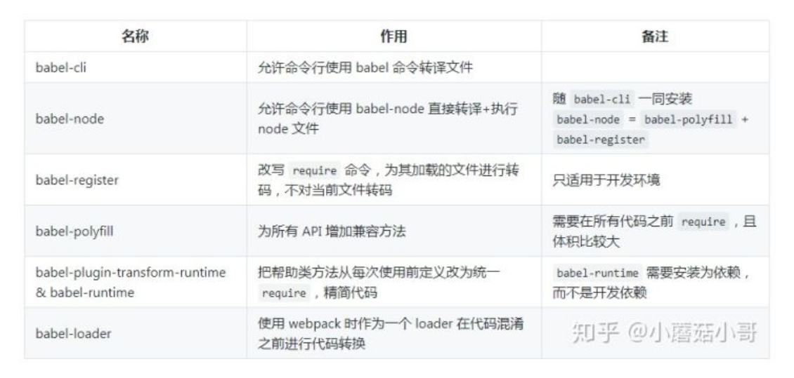

> 原文链接：https://zhuanlan.zhihu.com/p/43249121

- [Babel 到底做什么？怎么做的？](#babel-到底做什么怎么做的)
- [Babel6.x](#babel6x)
  - [使用的方式](#使用的方式)
  - [运行方式和插件](#运行方式和插件)
  - [配置文件](#配置文件)
  - [preset](#preset)
  - [执行顺序](#执行顺序)
  - [插件和 preset 的配置项](#插件和-preset-的配置项)
  - [env](#env)
  - [其他配置工具](#其他配置工具)
    - [babel-cli](#babel-cli)
    - [babel-node](#babel-node)
      - [babel-register](#babel-register)
      - [babel-polyfill](#babel-polyfill)
    - [babel-runtime 和 babel-plugin-transform-runtime (重点)](#babel-runtime-和-babel-plugin-transform-runtime-重点)
    - [babel-loader](#babel-loader)
- [Babel7.x](#babel7x)
  - [npm package 名称的变化（重点）](#npm-package-名称的变化重点)
  - [不再支持低版本 node](#不再支持低版本-node)
  - [only 和 ignore 匹配规则的变化](#only-和-ignore-匹配规则的变化)
  - [@babel/node 从 @babel/cli 中独立了](#babelnode-从-babelcli-中独立了)
  - [babel-upgrade](#babel-upgrade)

# Babel 到底做什么？怎么做的？

> 简单来说把 JavaScript 中 es2015/2016/2017/2046 的新语法转化为 es5，让低端运行环境(如浏览器和 node )能够认识并执行



# Babel6.x

## 使用的方式

1. 使用单体文件(standalone script)
2. 命令行(cli)
3. 构建工具的插件(webpack 的 babel-loader)
   _这三种方式只有入口不同而已，调用的 babel 内核，处理方式都是一样的，所以我们先不纠结入口的问题。_

## 运行方式和插件

babel 总共分为三个阶段: 解析，转换，生成
插件分为两种

1. **语法插件**: babel-plugin-syntax-trailing-function-commas(最后一个参数之后是不允许增加逗号的，如 callFoo(param1, param2,) 就是非法的)
2. **转译插件**: babel-plugin-syntax-trailing-function-commas(箭头函数 (a) => a 就会转化为 function (a) {return a})

## 配置文件

> .babelrc or package.json: babel

## preset

比如 es2015 是一套规范，包含大概十几二十个转译插件。如果每次要开发者一个个添加并安装，配置文件很长不说，npm install 的时间也会很长，更不谈我们可能还要同时使用其他规范呢。

- 官方内容，目前包括 env, react, flow, minify 等。这里最重要的是 env
- stage-x，这里面包含的都是当年最新规范的草案，每年更新。
  这里面还细分为
  - Stage 0 - 稻草人: 只是一个想法，经过 TC39 成员提出即可。
  - Stage 1 - 提案: 初步尝试
  - Stage 2 - 初稿: 完成初步规范
  - Stage 3 - 候选: 完成规范和浏览器初步实现
  - Stage 4 - 完成: 将被添加到下一年度发布
- es201x, latest: 这些是已经纳入到标准规范的语法。

## 执行顺序

- Plugin 会运行在 Preset 之前。
- Plugin 会从前到后顺序执行。
- Preset 的顺序则 刚好相反(从后向前)。

## 插件和 preset 的配置项

```json
"presets": [
    // 带了配置项，自己变成数组
    [
        // 第一个元素依然是名字
        "env",
        // 第二个元素是对象，列出配置项
        {
          "module": false
        }
    ],

    // 不带配置项，直接列出名字
    "stage-2"
]
```

## env

```json
{
  "presets": [
    [
      "env",
      {
        "targets": {
          "browsers": ["last 2 versions", "safari >= 7"]
        }
      }
    ]
  ]
}
```

```json
{
  "presets": [
    [
      "env",
      {
        "targets": {
          "node": "6.10"
        }
      }
    ]
  ]
}
```

另外一个有用的配置项是 modules。它的取值可以是 amd, umd, systemjs, commonjs 和 false。这可以让 babel 以特定的模块化格式来输出代码。如果选择 false 就不进行模块化处理。

## 其他配置工具

以上讨论了 babel 的核心处理机制和配置方法等，不论任何入口调用 babel 都走这一套。但文章开头提的那一堆 babel-_ 还是让人一头雾水。实际上这些 babel-_ 大多是不同的入口(方式)来使用 babel，下面来简单介绍一下。

### babel-cli

- 把 babel-cli 安装为 devDependencies
- 在 package.json 中添加 scripts (比如 prepublish)，使用 babel 命令编译文件
- npm publish
  这样既可以使用较新规范的 JS 语法编写源码，同时又能支持旧版环境。因为项目可能不太大，用不到构建工具 (webpack 或者 rollup)，于是在发布之前用 babel-cli 进行处理。

### babel-node

babel-node 是 babel-cli 的一部分，它不需要单独安装。

它的作用是在 node 环境中，直接运行 es2015 的代码，而不需要额外进行转码。例如我们有一个 js 文件以 es2015 的语法进行编写(如使用了箭头函数)。我们可以直接使用 babel-node es2015.js 进行执行，而不用再进行转码了。

可以说：babel-node = babel-polyfill + babel-register。那这两位又是谁呢？

#### babel-register

babel-register 模块改写 require 命令，为它加上一个钩子。此后，每当使用 require 加载 .js、.jsx、.es 和 .es6 后缀名的文件，就会先用 babel 进行转码。

使用时，必须首先加载 require('babel-register')。

需要注意的是，babel-register 只会对 require 命令加载的文件转码，而 不会对当前文件转码。

另外，由于它是实时转码，所以 只适合在开发环境使用。

#### babel-polyfill

babel 默认只转换 js 语法，而不转换新的 API，比如 Iterator、Generator、Set、Maps、Proxy、Reflect、Symbol、Promise 等全局对象，以及一些定义在全局对象上的方法(比如 Object.assign)都不会转码。

举例来说，es2015 在 Array 对象上新增了 Array.from 方法。babel 就不会转码这个方法。如果想让这个方法运行，必须使用 babel-polyfill。(内部集成了 core-js 和 regenerator)

使用时，在所有代码运行之前增加 require('babel-polyfill')。或者更常规的操作是在 webpack.config.js 中将 babel-polyfill 作为第一个 entry。因此必须把 babel-polyfill 作为 dependencies 而不是 devDependencies

babel-polyfill 主要有两个缺点：

使用 babel-polyfill 会导致打出来的包非常大，因为 babel-polyfill 是一个整体，把所有方法都加到原型链上。比如我们只使用了 Array.from，但它把 Object.defineProperty 也给加上了，这就是一种浪费了。这个问题可以通过单独使用 core-js 的某个类库来解决，core-js 都是分开的。
babel-polyfill 会污染全局变量，给很多类的原型链上都作了修改，如果我们开发的也是一个类库供其他开发者使用，这种情况就会变得非常不可控。
因此在实际使用中，如果我们无法忍受这两个缺点(尤其是第二个)，通常我们会倾向于使用 babel-plugin-transform-runtime。

但如果代码中包含高版本 js 中类型的实例方法 (例如 [1,2,3].includes(1))，这还是要使用 polyfill。

### babel-runtime 和 babel-plugin-transform-runtime (重点)

我们时常在项目中看到 .babelrc 中使用 babel-plugin-transform-runtime，而 package.json 中的 dependencies (注意不是 devDependencies) 又包含了 babel-runtime，那这两个是不是成套使用的呢？他们又起什么作用呢？

先说 babel-plugin-transform-runtime。

babel 会转换 js 语法，之前已经提过了。以 async/await 举例，如果不使用这个 plugin (即默认情况)，转换后的代码大概是：

```javascript
// babel 添加一个方法，把 async 转化为 generator
function _asyncToGenerator(fn) { return function () {....}} // 很长很长一段

// 具体使用处
var _ref = _asyncToGenerator(function* (arg1, arg2) {
  yield (0, something)(arg1, arg2);
});
```

不用过于纠结具体的语法，只需看到，这个 \_asyncToGenerator 在当前文件被定义，然后被使用了，以替换源代码的 await。但每个被转化的文件都会插入一段 \_asyncToGenerator 这就导致重复和浪费了。

在使用了 babel-plugin-transform-runtime 了之后，转化后的代码会变成

```javascript
// 从直接定义改为引用，这样就不会重复定义了。
var _asyncToGenerator2 = require("babel-runtime/helpers/asyncToGenerator");
var _asyncToGenerator3 = _interopRequireDefault(_asyncToGenerator2);

// 具体使用处是一样的
var _ref = _asyncToGenerator3(function* (arg1, arg2) {
  yield (0, something)(arg1, arg2);
});
```

但在这里，我们也发现 babel-runtime 出场了，它就是这些方法的集合处，也因此，在使用 babel-plugin-transform-runtime 的时候必须把 babel-runtime 当做依赖。

babel-runtime 它内部集成了

1. core-js: 转换一些内置类 (Promise, Symbols 等等) 和静态方法 (Array.from 等)。绝大部分转换是这里做的。自动引入。
2. regenerator: 作为 core-js 的拾遗补漏，主要是 generator/yield 和 async/await 两组的支持。当代码中有使用 generators/async 时自动引入。
3. helpers, 如上面的 asyncToGenerator 就是其中之一，其他还有如 jsx, classCallCheck 等等，可以查看 babel-helpers。在代码中有内置的 helpers 使用时(如上面的第一段代码)移除定义，并插入引用(于是就变成了第二段代码)。

babel-plugin-transform-runtime 不支持 实例方法 (例如 [1,2,3].includes(1))

此外补充一点，把 helpers 抽离并统一起来，避免重复代码的工作还有一个 plugin 也能做，叫做 babel-plugin-external-helpers。但因为我们使用的 transform-runtime 已经包含了这个功能，因此不必重复使用。而且 babel 的作者们也已经开始讨论这两个插件过于类似，正在讨论在 babel 7 中把 external-helpers 删除，讨论在 issue#5699 中。

### babel-loader

一些大型的项目都会有构建工具 (如 webpack 或 rollup) 来进行代码构建和压缩 (uglify)。理论上来说，我们也可以对压缩后的代码进行 babel 处理，但那会非常慢。因此如果在 uglify 之前就加入 babel 处理，岂不完美？

所以就有了 babel 插入到构建工具内部这样的需求。以(我还算熟悉的) webpack 为例，webpack 有 loader 的概念，因此就出现了 babel-loader。

和 babel-cli 一样，babel-loader 也会读取 .babelrc 或者 package.json 中的 babel 段作为自己的配置，之后的内核处理也是相同。唯一比 babel-cli 复杂的是，它需要和 webpack 交互，因此需要在 webpack 这边进行配置。比较常见的如下：

```javascript
module: {
  rules: [
    {
      test: /\.js$/,
      exclude: /(node_modules|bower_components)/,
      loader: "babel-loader",
    },
  ];
}
```

```javascript
// loader: 'babel-loader' 改成如下：
use: {
  loader: 'babel-loader',
  options: {
    // 配置项在这里
  }
}
```

# Babel7.x

> preset 的变更：淘汰 es201x，删除 stage-x，强推 env (重点)

淘汰 es201x 的目的是把选择环境的工作交给 env 自动进行，而不需要开发者投入精力。凡是使用 es201x 的开发者，都应当使用 env 进行替换。但这里的淘汰 (原文 deprecated) 并不是删除，只是不推荐使用了，不好说 babel 8 就真的删了。

与之相比，stage-x 就没那么好运了，它们直接被删了。这是因为 babel 团队认为为这些 “不稳定的草案” 花费精力去更新 preset 相当浪费。stage-x 虽然删除了，但它包含的插件并没有删除(只是被更名了，可以看下面一节)，我们依然可以显式地声明这些插件来获得等价的效果

为了减少开发者替换配置文件的机械工作，babel 开发了一款 babel-upgrade 的工具，它会检测 babel 配置中的 stage-x 并且替换成对应的 plugins。除此之外它还有其他功能，我们一会儿再详细看。(总之目的就是让你更加平滑地迁移到 babel 7)

## npm package 名称的变化（重点）

1. babel-cli 变成了 @babel/cli
2. babel-preset-env 变成了 @babel/preset-env.进一步，还可以省略 preset 而简写为 @babel/env

顺带提一句，上面提过的 babel 解析语法的内核 babylon 现在重命名为 @babel/parser，看起来是被收编了。

上文提过的 stage-x 被删除了，它包含的插件虽然保留，但也被重命名了。babel 团队希望更明显地区分已经位于规范中的插件 (如 es2015 的 babel-plugin-transform-arrow-functions) 和仅仅位于草案中的插件 (如 stage-0 的 @babel/plugin-proposal-function-bind)。方式就是在名字中增加 proposal，所有包含在 stage-x 的转译插件都使用了这个前缀，语法插件不在其列。

最后，如果插件名称中包含了规范名称 (-es2015-, -es3- 之类的)，一律删除。例如 babel-plugin-transform-es2015-classes 变成了 @babel/plugin-transform-classes。

## 不再支持低版本 node

这里的不再支持，指的是在这些低版本 node 环境中不能使用 babel 转译代码，但 babel 转译后的代码依然能在这些环境上运行，这点不要混淆。

## only 和 ignore 匹配规则的变化

在 babel 6 时，ignore 选项如果包含 _ .foo.js，实际上的含义 (转化为 glob) 是 ./\*\* /_.foo.js，也就是当前目录 包括子目录 的所有 foo.js 结尾的文件。这可能和开发者常规的认识有悖。

于是在 babel 7，相同的表达式 _ .foo.js 只作用于当前目录，不作用于子目录。如果依然想作用于子目录的，就要按照 glob 的完整规范书写为 ./\*\*/ _.foo.js 才可以。only 也是相同。

这个规则变化只作用于通配符，不作用于路径。所以 node_modules 依然包含所有它的子目录，而不单单只有一层。(否则全世界开发者都要爆炸)

## @babel/node 从 @babel/cli 中独立了

和 babel 6 不同，如果要使用 @babel/node，就必须单独安装，并添加到依赖中。

## babel-upgrade
