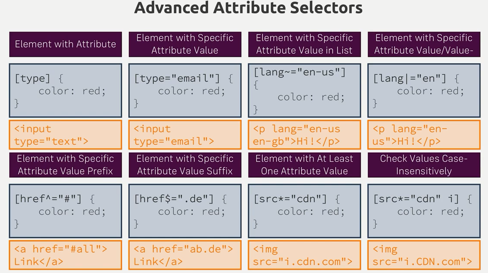
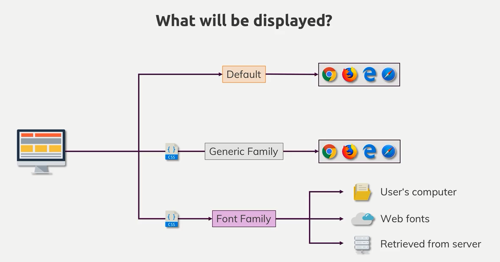
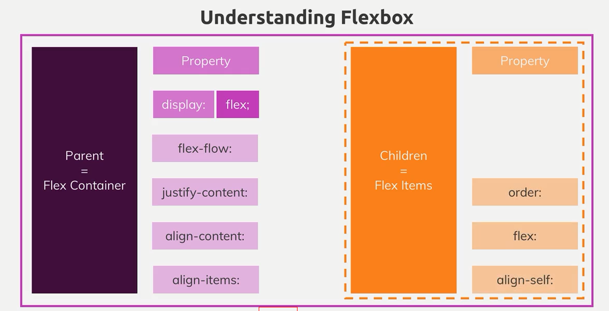

- [CSS 放置元素的一些知识](#css-放置元素的一些知识)
- [理解背景图片和图片](#理解背景图片和图片)
  - [有关于 background 的一些属性](#有关于-background-的一些属性)
  - [有关于 img 标签的一些知识](#有关于-img-标签的一些知识)
  - [理解 Linear-Gradients](#理解-linear-gradients)
  - [理解 Radial-Gradient](#理解-radial-gradient)
- [理解 CSS 相关单位](#理解-css-相关单位)
- [网页自适应](#网页自适应)
- [表单元素选择器](#表单元素选择器)
- [文字和字体](#文字和字体)
- [FlexBox](#flexbox)
- [CSS-Grid](#css-grid)
- [CSS Transforming](#css-transforming)
- [动画效果](#动画效果)

# CSS 放置元素的一些知识

- **position: static**
  > - 浏览器默认的 position 取值 static
- **Postion: fixed;**
  > - 位置相对于 viewport;
  > - 可以使用 vh (top: 50vh);
- **z-index**
  > - z-index 作用于设置了 position 属性的元素
  > - 默认的 z-index 的值为 0
  > - z-index: auto 和 z-index: 0 等效
  > - z-index 受限于父元素的 z-index 取值
- **Position: absolute**
  > - 如果`没有设置了postion的祖先元素`, `位置设定相对于html元素`
  > - 如果`有设置了postion的祖先元素`, `位置设定相对于最近的设置了的祖先元素`
- **position: relative**
  > - 设置该 position 的元素没有脱离出文档流, 位置设定相对于原先 static 设置所在的位置而定
- **overflow**
  > - 如果 html 未设置 overflow 属性, 在 body 设置 overflow 属性不生效, 并且 css 默认会将该属性设置在 html 中

# 理解背景图片和图片

## 有关于 background 的一些属性

- **background-image: url(./...)**
- **background-color**
  > - image, color 可以共存 image 在 color 上面显示
- **background-size: 300px(%) 100px(%)**
  > - 第一个值是宽度, 第二个值是高度
  > - cover 撑满容器 contain 在该容器内尽可能地显示图片
- **background-repeat: repeat | no-repeat | repeat-x | repeat-y**
  > - size 与 repeat 一起使用实现按(x|y)轴平铺的效果
- **background-position: left 10% bottom 20%;**
  > - 在 size 设置为 cover 的情况下, 有部分图片被裁剪显示在容器之外(因为需要维持原图片比例), 通过调整 position 调整显示的区域, 设置为 center 即居中显示原图片信息, 详细的设置如上
- background-origin: 设置背景的有效位置
- background-clip: 裁剪图片的有效位置
  > - border-box | content-box | padding-box
  > - 设置 clip 即重写了 origin
- background-attachment: 下滚动作发生时, img 的反应设定
- **简写**
  > - background: url(./..) left 10% top 20%/cover no-repeat border-box

## 有关于 img 标签的一些知识

- **在选定的 img 中设定长宽比例相对的是图片的原始比例, 而非父元素**
- **在父元素设置 display: inline-block, 使图片百分比依赖于父元素**

## 理解 Linear-Gradients

- **background-image: linear-gradient(towards,[color precent]\*)**
  > - 设置渐变的方向(to bottom | to left bottom | 180deg(to bottom))
  > - 设置需要渐变的颜色以及该渐变色所花费的容器百分比
  > - 完整的例子 background-image: linear-gradient(180deg, red 70%, blue 80%, black)

## 理解 Radial-Gradient

- **background-image: radial-gradient([[shape size] at postition],[color precent]\*)**

  > - 设置渐变的形状以及整个变形区域的大小(特殊预设取值:(colest | farthest) (side | corner))
  > - 设置渐变形状的几何中心所处容器的位置
  > - 设置渐变的颜色以及该渐变色所花费容器半径的百分比
  > - 完整例子 background-image: radial-gradient(ellipse closest-corner at 20% 50%, red 50%, blue 70%, green)

- **使用 filter 给背景图片加滤镜**

# 理解 CSS 相关单位


# 网页自适应

- **理解 html viewport meta 标签**

> - \<meta name="viewport" content="width=device-width, initial-scale=1.0, user-scable=yes[default]/no, maximum-scale=2.0, minimum-scale=0.5>

- **媒体查询横屏竖屏(orientation: portrait/landscape)**

# 表单元素选择器



# 文字和字体



- **本地引入字体**

```css
@font-face {
  font-family：ExampleFont;
  src：url（/path/to/fonts/examplefont.woff）format（'woff'），
       url（/path/to/fonts/examplefont.eot）format（'eot'）;
  font-weight：400;
  font-style：normal;
  font-display：fallback;
}
```

- **一些不常用的属性**

  > - letter-spac: px/em
  > - white-space:pre/pre-wrap/pre-line/no-wrap
  > - line-height: 2（倍数） / px
  > - text-decoration: underline/overline/ line-through
  > - text-decoration: underline dotted red
  > - text-shadow: 5 px 5px 2px gray

- **简写**

  > - font:italic(`style`) small-caps(`variant`) 700(`weight`) 1.2rem/2(`size/line-height`) "AnonymousPro", sans-serif(`family`);

- **font-display**
  > - [ auto | block | swap | fallback | optional ]
  > - auto 字体显示策略由用户代理定义。
  >   block 给字体面临一个短暂的周期和无限的交换周期。
  > - swap 为字体提供了一个非常小的块周期和无限的交换周期。
  > - fallback 为字体提供了一个非常小的块周期和短暂的交换周期。
  > - optional 为字体提供了一个非常小的块周期并且没有交换周期。

# FlexBox



- **order: 根据 flexBox 的方向数字从小到大排列，默认的值是**

- **align-self: 重写 align-items**

- **flex-grow/flex=shrink/flex-basis**

# CSS-Grid

- **定义 container 容器网格**

```css
grid-template-column: repeat(4, 25%);
grid-template-rows: 5rem auto;
grid-template-rows: 5rem minmax(10px, auto) 100px;

grid-template-areas: "header header header header"
                      "side side main main"
                      "footer footer footer footer"

grid-template-rows: 3.5rem auto fit-content(8rem);
/*fit-content: 该区域大小不会大于8rem*/
```

- **根据容器划分的网格自定义子元素占的区域**

```css
grid-column-start: 3;
grid-column-end: 5;
grid-column:3 / 5;
grid-area: header;

grid-row-start: 1;
grid-row-end: 3;
grid-row-end: span 2;
grid-row:1 / 3
grid-area: footer;
```

> 网格可以被重复使用

- **网格间隙定义**

```css
grid-column-gap: 20px;
grid-row-gap: 10px;
```

- **容器元素以及定义子元素的排列方向**

```css
justify-content: strech/center/start/end
justify-items: strech/center/start/end
/*横向*/
align-content: strech/center/start/end
align-items: strech/center/start/end
/*竖向*/
```

- **子元素对齐**

```css
justify-self: strech/center/start/end
align-self: strech/center/start/end
```

- **Grid 容器的自动流动（autoflow）**

```css
grid-auto-rows: minmax(8rem, auto)
grid-auto-colums: 5rem
grid-auto-flow: column
```

- Grid 容器元素根据 view port 自动填充

```css
grid-template-columns: repeat(auto-fill/auto-fit, 10rem);
```

# CSS Transforming

- **旋转元素**

  > - tranform-origin: 50% 50% (center)
  > - trnaform: rotateZ(45deg)

- **平移元素**

  > - transformX(3.5rem) transformY(-1rem)

- **歪斜元素**

  > - skew(20deg)

- **放缩元素**

  > - scale(1.5)

- **透视，3D 变换，3D 遮挡显示**

# 动画效果

- **transition: opcity(需要动画效果的属性) 200ms(动画效果持续的时间) ease-out(动画效果的方式) 1s(延迟时间)**

- **CSS-Animation**

```css
@keyframes wiggle {
  0% {
    transform: rotateZ(0deg);
  }
  50% {
    ...;
  }
  100% {
    transform: rotateZ(10deg);
  }
}

.main-nav__item--cta {
  animation: wiggle 200ms 3s 8 ease-out alternate/forwards/backwards;
}
```

```javascript
ctaButton.addEventListener("animationstart/animationend/");
```
