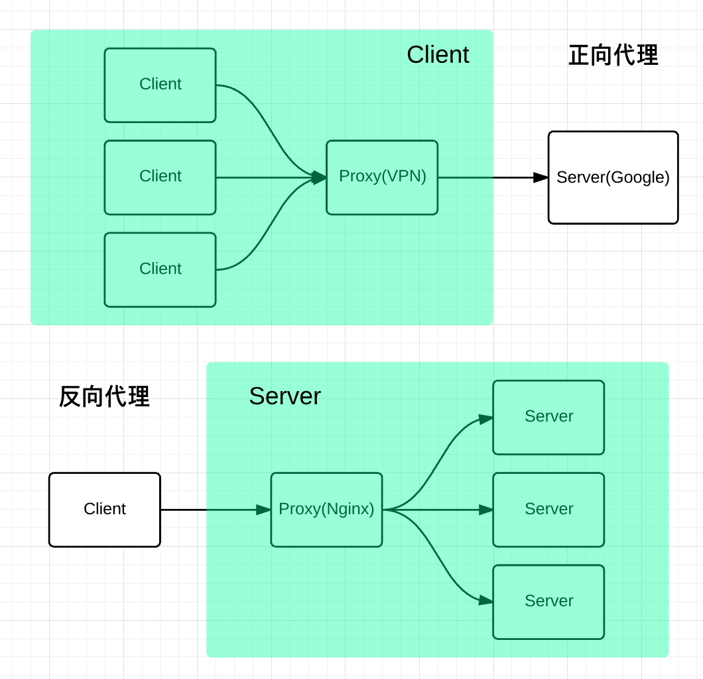

> 原文地址：https://juejin.im/post/5c85a64d6fb9a04a0e2e038c

## nginx 在应用程序中的作用

- 解决跨域
- 请求过滤
- 配置 gzip
- 负载均衡
- 静态资源服务器
  ...

> nginx 是一个高性能的 HTTP 和反向代理服务器，也是一个通用的 TCP/UDP 代理服务器，最初由俄罗斯人 Igor Sysoev 编写。

## 正向代理与反向代理

**代理**是在服务器和客户端之间假设的一层服务器，**代理**将接收客户端的请求并将它转发给服务器，然后将服务端的响应转发给客户端。

不管是正向代理还是反向代理，实现的都是上面的功能。

**正向代理**是为我们服务的，即为客户端服务的，客户端可以根据正向代理访问到它本身无法访问到的服务器资源  
**正向代理**对我们是透明的，对服务端是非透明的，即服务端并不知道自己收到的是来自代理的访问还是来自真实客户端的访问。

**反向代理**是为服务端服务的，反向代理可以帮助服务器接收来自客户端的请求，帮助服务器做请求转发，负载均衡等。

**反向代理**对服务端是透明的，对我们是非透明的，即我们并不知道自己访问的是代理服务器，而服务器知道反向代理在为他服务。

## 基本配置


```
events {

}

http
{
    server
    {
        location path
        {
            ...
        }
        location path
        {
            ...
        }
     }

    server
    {
        ...
    }

}

```

- `main`:nginx 的全局配置，对全局生效。
- `events`:配置影响 nginx 服务器或与用户的网络连接。
- `http`：可以嵌套多个 server，配置**代理**，**缓存**，**日志定义**等绝大多数功能和第三方模块的配置
- `server`：配置虚拟主机的相关参数，一个 http 中可以有多个 server。
- `location`：配置请求的路由，以及各种页面的处理情况。
- `upstream`：配置后端服务器具体地址，负载均衡配置不可或缺的部分。

内置变量

`$host`:请求信息中的 Host，如果请求中没有 Host 行，则等于设置的服务器名

`$request_method`:客户端请求类型，如 GET、POST

`$remote_addr`:客户端的 IP 地址

`$args`:请求中的参数

`$content_length`:请求头中的 Content-length 字段

`$http_user_agent`:客户端 agent 信息

`$http_cookie`:客户端 cookie 信息

`$remote_port`:客户端的端口

`$server_protocol`:请求使用的协议，如 HTTP/1.0、·HTTP/1.1`

`$server_addr`:服务器地址

`$server_name`:服务器名称

`$server_port`:服务器的端口号

## 解决跨域

nginx 解决跨域的原理

- 前端 server 的域名为：fe.server.com
- 后端服务的域名为：dev.server.com

现在我在 fe.server.com 对 dev.server.com 发起请求一定会出现跨域。

现在我们只需要启动一个 nginx 服务器，将 server_name 设置为 fe.server.com,然后设置相应的 location 以拦截前端需要跨域的请求，最后将请求代理回 dev.server.

```
server {
        listen       80;
        server_name  fe.server.com;
        location / {
                proxy_pass dev.server.com;
        }
}
```

这样可以完美绕过浏览器的同源策略：fe.server.com 访问 nginx 的 fe.server.com 属于同源访问，而 nginx 对服务端转发的请求不会触发浏览器的同源策略。

## 请求过滤

根据状态码过滤

```
error_page 500 501 502 503 504 506 /50x.html;
    location = /50x.html {
        #将跟路径改编为存放html的路径。
        root /root/static/html;
    }
```

根据 URL 名称过滤，精准匹配 URL，不匹配的 URL 全部重定向到主页

```
location / {
    rewrite  ^.*$ /index.html  redirect;
}
```

根据请求类型过滤。

```
if ( $request_method !~ ^(GET|POST|HEAD)$ ) {
        return 403;
    }
```

## 配置 gzip

> GZIP 是规定的三种标准 HTTP 压缩格式之一。目前绝大多数的网站都在使用 GZIP 传输 HTML、CSS、JavaScript 等资源文件。

对于文本文件，GZip 的效果非常明显，开启后传输所需流量大约会降至 1/4 ~ 1/3。

并不是每个浏览器都支持 gzip 的，如何知道客户端是否支持 gzip 呢，请求头中的 Accept-Encoding 来标识对压缩的支持。

```
  gzip                    on;
    gzip_http_version       1.1;
    gzip_comp_level         5;
    gzip_min_length         1000;
    gzip_types text/csv text/xml text/css text/plain text/javascript application/javascript application/x-javascript application/json application/xml;
```

## 负载均衡

Upstream 指定后端服务器地址列表

```
upstream balanceServer {
    server 10.1.22.33:12345;
    server 10.1.22.34:12345;
    server 10.1.22.35:12345;
}
```

在 server 中拦截响应请求，并将请求转发到 Upstream 中配置的服务器列表。

```
  server {
        server_name  fe.server.com;
        listen 80;
        location /api {
            proxy_pass http://balanceServer;
        }
    }
```

nginx 实现负载均衡的策略

1. 轮询策略

```
upstream balanceServer {
    server 10.1.22.33:12345;
    server 10.1.22.34:12345;
    server 10.1.22.35:12345;
}
```

2. 最小连接数策略

```
upstream balanceServer {
    least_conn;
    server 10.1.22.33:12345;
    server 10.1.22.34:12345;
    server 10.1.22.35:12345;
}

```

3. 最快响应时间策略

```
upstream balanceServer {
    fair;
    server 10.1.22.33:12345;
    server 10.1.22.34:12345;
    server 10.1.22.35:12345;
}
```

4. 客户端 ip 绑定

```
upstream balanceServer {
    ip_hash;
    server 10.1.22.33:12345;
    server 10.1.22.34:12345;
    server 10.1.22.35:12345;
}
```

## 静态资源服务器

```
location ~* \.(png|gif|jpg|jpeg)$ {
    root    /root/static/;
    autoindex on;
    access_log  off;
    expires     10h;# 设置过期时间为10小时
}
```

匹配以 png|gif|jpg|jpeg 为结尾的请求，并将请求转发到本地路径，root 中指定的路径即 nginx 本地路径。同时也可以进行一些缓存的设置。
