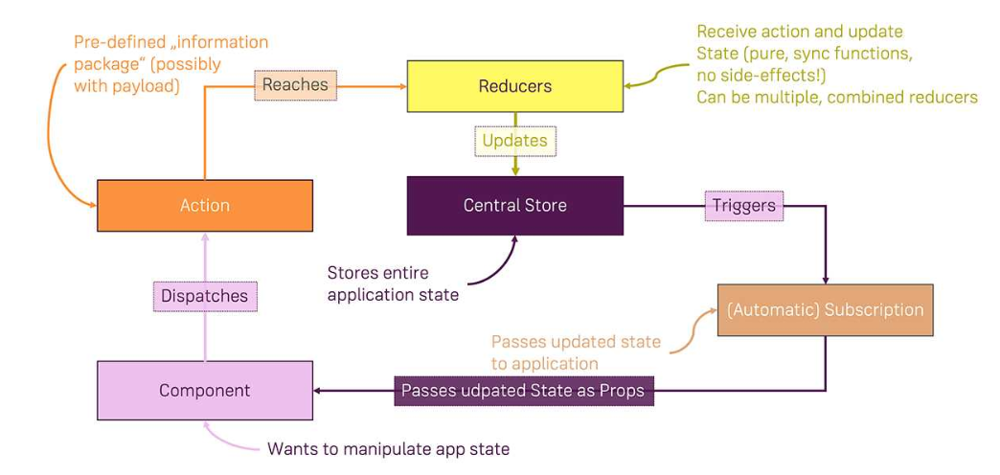

- [什么是 Redux?](#什么是-redux)
  - [Redux 四个主要构建块组成](#redux-四个主要构建块组成)
- [什么是 React’s Context API?](#什么是-reacts-context-api)
  - [Context Object](#context-object)
  - [Context provider](#context-provider)
  - [Context Consumer](#context-consumer)
    - [使用 Context.Consumer](#使用-contextconsumer)
    - [使用 static contextType](#使用-static-contexttype)
- [通过 Context 更新状态](#通过-context-更新状态)
- [React 的 Context API 会取代 Redux 吗?](#react-的-context-api-会取代-redux-吗)

# 什么是 Redux?

> Redux 用于在集中位置管理 React 应用程序的状态, 从技术上讲，Redux 不仅限于在 React 应用程序中使用 - 实际上还有其他技术的实现 (NgRx for Angular)

## Redux 四个主要构建块组成

1. 一个单一的，集中的状态仓（即你可以说的全局 JS 对象），它不是直接可访问的或可变的
2. Reducer 函数，包含更改和更新全局状态的逻辑(通过返回`旧状态的新副本`以及所有必需的更改)
3. 可以调度以触发 reducer 函数运行的操作
4. 用于从全局状态获取数据的订阅（例如，在 React 组件中使用它）
   

# 什么是 React’s Context API?

## Context Object

```javascript
import React from "react";

export default React.createContext({}); // argument is the default starting value
```

您可以在单独的文件中或在组件文件中的组件旁边定义 Context 对象。您还可以在同一个应用程序中拥有多个 Context 对象。

## Context provider

通过创建 Context，您现在可以将其提供给应该能够与之交互的所有组件

对于应该在整个应用程序中可用的数据，您必须在根组件中提供 Context（例如<App />）。如果您只在应用程序的一部分中需要 Context，则可以在组件树的更远处的组件上提供它

```javascript
// Other imports...
import ShopContext from './path/to/shop-context'; // The path to the file where you called React.createContext()

class App extends Component {
  render() {
    return (
      <ShopContext.Provider value={{
          products: [],
          cart: []
        }
      }>
        {/*  Any child or child of a child component in here can access 'ShopContext'*/}
      </ShopContext.Provider />
    );
  }
}
```

> 您在此处设置的值将转发到包装的子组件。如果值发生变化，它也会在子组件中发生变化

> 传递给值的数据更新由 Context 的消费者接收，并允许我们将 Context API 用作全局状态管理工具

## Context Consumer

### 使用 Context.Consumer

```javascript
// Other imports...
import ShopContext from "../context/shop-context";

class ProductsPage extends Component {
  render() {
    return (
      <ShopContext.Consumer>
        {(context) => (
          <React.Fragment>
            <MainNavigation
              cartItemNumber={context.cart.reduce((count, curItem) => {
                return count + curItem.quantity;
              }, 0)}
            />
            <main className="products">...</main>
          </React.Fragment>
        )}
      </ShopContext.Consumer>
    );
  }
}

export default ProductsPage;
```

> <ShopContext.Consumer>是一个包装器组件，我们可以用它来“注入”这个子组件中某些父组件（不必是直接父组件）中提供的 Context。

> 上下文对象是传递给<ShopContext.Provider>上的值的完全相同的对象 - 这意味着当传递给值的数据发生更改时，子组件中的上下文对象也会更改，因此子组件会更新。这是基于某种集中状态更新不同组件的一种很好的形式。

### 使用 static contextType

> 除了使用<ShopContext.Consumer>之外，我们还可以通过在我们的（基于类的）子组件中设置静态属性来访问我们的 Context。重要提示：与<ShopContext.Consumer>不同，您可以在功能和基于类的组件中使用它，此方法仅适用于基于类（“有状态”）的组件！

```javascript
// Other imports...
import ShopContext from "../context/shop-context";

class CartPage extends Component {
  static contextType = ShopContext;

  componentDidMount() {
    // Advantage of static contextType: We can now also access Context in the rest of the component
    console.log(this.context);
  }

  render() {
    return (
      <React.Fragment>
        <MainNavigation
          cartItemNumber={this.context.cart.reduce((count, curItem) => {
            return count + curItem.quantity;
          }, 0)}
        />
        <main className="cart">...</main>
      </React.Fragment>
    );
  }
}

export default CartPage;
```

# 通过 Context 更新状态

- context 和 state 结合

```javascript
import React, { Component } from 'react';
import ShopContext from './shop-context';

class App extends Component {
  state = {
    products: [
      { id: 'p1', title: 'Gaming Mouse', price: 29.99 },
      { id: 'p2', title: 'Harry Potter 3', price: 9.99 },
      ...
    ],
    cart: []
  };

  addProductToCart = product => {
    const updatedCart = [...this.state.cart];
    // Logic to update the cart correctly
    // See finished code (at the beginning of the article)
    this.setState({ cart: updatedCart });

  };

  removeProductFromCart = productId => {
    const updatedCart = [...this.state.cart];
    // Logic to update the cart correctly
    // See finished code (at the beginning of the article)
    this.setState({ cart: updatedCart });
  };

  render() {
    return (
      <ShopContext.Provider
        value={{
          products: this.state.products,
          cart: this.state.cart,
          addProductToCart: this.addProductToCart,
          removeProductFromCart: this.removeProductFromCart
        }}
      >
        ...
      </ShopContext.Provider>
    );
  }
}

export default GlobalState;
```

# React 的 Context API 会取代 Redux 吗?

> 我个人的总结是新的上下文已经准备好用于低频率的不太可能的更新（如语言环境/主题）。以与使用旧上下文相同的方式使用它也是很好的。即对于静态值，然后通过订阅传播更新。它尚未准备好用作所有类似 Flux 状态传播的替代品。
